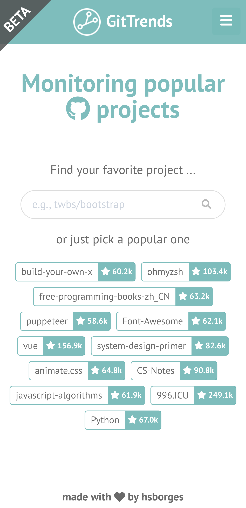
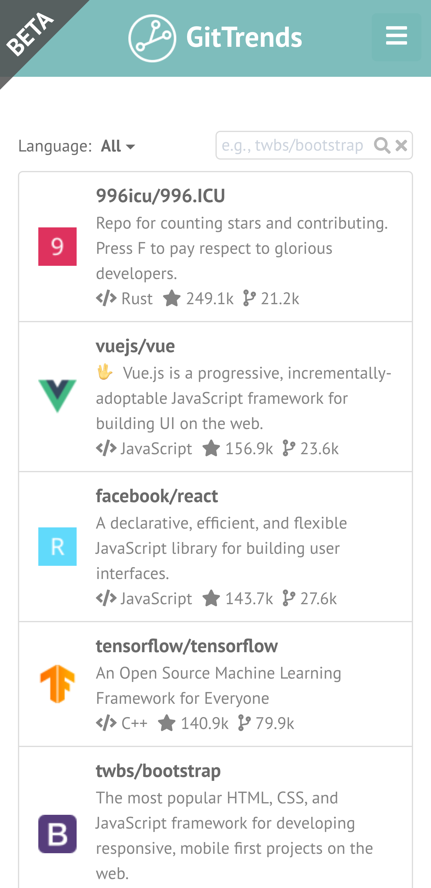
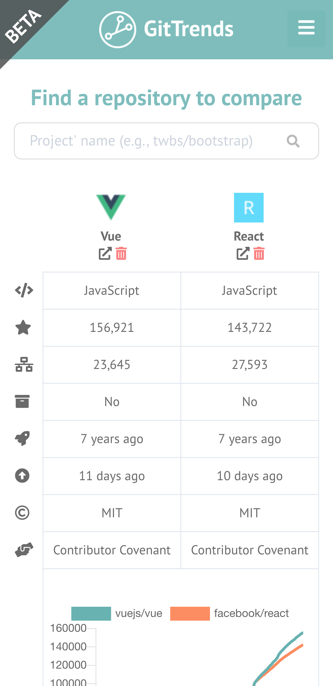

[![Contributors][contributors-shield]][contributors-url]
[![Stargazers][stars-shield]][stars-url] [![Issues][issues-shield]][issues-url]
[![MIT License][license-shield]][license-url]

<!-- PROJECT LOGO -->
 

  

  <h3 align="center">GitTrends.app</h3>

  

    Monitoring popular open source projects
     
    <a href="https://gittrends.app">Website</a>
    ·
    <a href="https://github.com/hsborges/gittrends.app/issues">Report Bug</a>
    ·
    <a href="https://github.com/hsborges/gittrends.app/issues">Request Feature</a>
  

<!-- ABOUT THE PROJECT -->

## About

<a href="https://www.gittrends.app" target="_blank">

  
  
  

</a>

GitTrends is a tool created to support developers, project maintainers and
software engineering researchers by providing useful insights on popular open
source projects hosted on GitHub.

### Built With

- [Node.js](https://nodejs.org/)
- [Vue.js](https://vuejs.org/)

<!-- ROADMAP -->

## Roadmap

See the [open issues](https://github.com/hsborges/gittrends.app/issues) for a
list of proposed features (and known issues).

<!-- CONTRIBUTING -->

## Contributing

Contributions are what make the open source community such an amazing place to
be learn, inspire, and create. Any contributions you make are **greatly
appreciated**.

1. Fork the Project
2. Create your Feature Branch (`git checkout -b feature/AmazingFeature`)
3. Commit your Changes (`git commit -m 'Add some AmazingFeature'`)
4. Push to the Branch (`git push origin feature/AmazingFeature`)
5. Open a Pull Request

<!-- LICENSE -->

## License

Distributed under the MIT License. See `LICENSE` for more information.

<!-- CONTACT -->

## Contact

Hudson Silva Borges - [@hudsonsilbor](https://twitter.com/hudsonsilbor) -
hsborges[at]facom.ufms.br

Project Link:
[https://github.com/hsborges/gittrends.app](https://github.com/hsborges/gittrends.app)

<!-- ACKNOWLEDGEMENTS -->

## Acknowledgements

- [Marco Tulio Valente](https://github.com/mtov)

<!-- MARKDOWN LINKS & IMAGES -->
<!-- https://www.markdownguide.org/basic-syntax/#reference-style-links -->

[contributors-shield]:
  https://img.shields.io/github/contributors/hsborges/gittrends.app.svg?style=flat-square
[contributors-url]:
  https://github.com/hsborges/gittrends.app/graphs/contributors
[stars-shield]:
  https://img.shields.io/github/stars/hsborges/gittrends.app.svg?style=flat-square
[stars-url]: https://github.com/hsborges/gittrends.app/stargazers
[issues-shield]:
  https://img.shields.io/github/issues/hsborges/gittrends.app.svg?style=flat-square
[issues-url]: https://github.com/hsborges/gittrends.app/issues
[license-shield]:
  https://img.shields.io/github/license/hsborges/gittrends.app.svg?style=flat-square
[license-url]: https://github.com/hsborges/gittrends.app/blob/master/LICENSE.md
[linkedin-shield]:
  https://img.shields.io/badge/-LinkedIn-black.svg?style=flat-square&logo=linkedin&colorB=555
[linkedin-url]: https://linkedin.com/in/othneildrew
